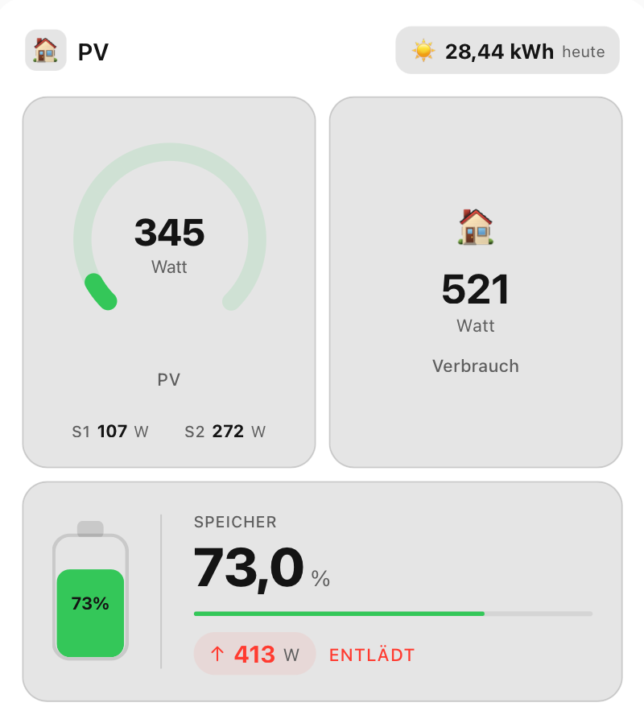

# Solar Entities Card

[](https://github.com/hacs/integration)


Eine Custom Lovelace Card für Home Assistant zur Anzeige von Solar-Entitäten: PV-Leistung, String-Leistungen, Batteriespeicher und Hausverbrauch.

## Vorschau



Die Karte zeigt:
- **PV-Leistung** als großen 270°-Ring-Gauge
- **S1 & S2** als kompakte Zahlenwerte unterhalb des PV-Labels
- **Speicher** als Batterie-Grafik mit Ladestand (%) und Leistungsanzeige (+/− W)
- **Hausverbrauch** als Zahlenwert
- **PV Tagesertrag** im Header (anklickbar)

Alle Elemente sind anklickbar und öffnen die native Home Assistant Detailansicht.

## Installation via HACS

1. HACS öffnen → **Frontend** → **+ Erkunden & Hinzufügen**
2. Nach „Solar Entities Card" suchen
3. Installieren und HA neu laden

### Manuelle HACS-Installation (Custom Repository)

1. HACS öffnen → **Frontend** → Drei-Punkte-Menü → **Benutzerdefinierte Repositories**
2. URL eingeben: `https://github.com/Cangos655/solar-entities-card`
3. Kategorie: **Lovelace**
4. Hinzufügen und installieren

## Konfiguration

```yaml
type: custom:solar-entities-card
title: Haus
entity_pv: sensor.pv_leistung
entity_string1: sensor.string1_leistung
entity_string2: sensor.string2_leistung
entity_battery_soc: sensor.speicher_soc
entity_battery_power: sensor.speicher_leistung
entity_house: sensor.hausverbrauch
entity_daily_yield: sensor.pv_tagesertrag
max_pv: 6000
max_string: 4000
max_house: 3000
max_battery: 5000
```

## Optionen

| Option | Beschreibung | Standard |
|--------|-------------|---------|
| `title` | Kartentitel | `Haus` |
| `entity_pv` | PV Gesamtleistung (W) | – |
| `entity_string1` | String 1 Leistung (W) | – |
| `entity_string2` | String 2 Leistung (W) | – |
| `entity_battery_soc` | Speicher Ladestand (%) | – |
| `entity_battery_power` | Speicher Leistung +/− (W) | – |
| `entity_house` | Hausverbrauch (W) | – |
| `entity_daily_yield` | PV Tagesertrag (kWh) | – |
| `max_pv` | Max. PV Leistung für Gauge (W) | `6000` |
| `max_string` | Max. String Leistung (W) | `4000` |
| `max_house` | Max. Hausverbrauch (W) | `3000` |
| `max_battery` | Max. Speicher Leistung (W) | `5000` |

## GUI-Editor

Die Karte unterstützt den visuellen Editor in Home Assistant. Alle Entitäten und Maximalwerte können dort direkt konfiguriert werden.
